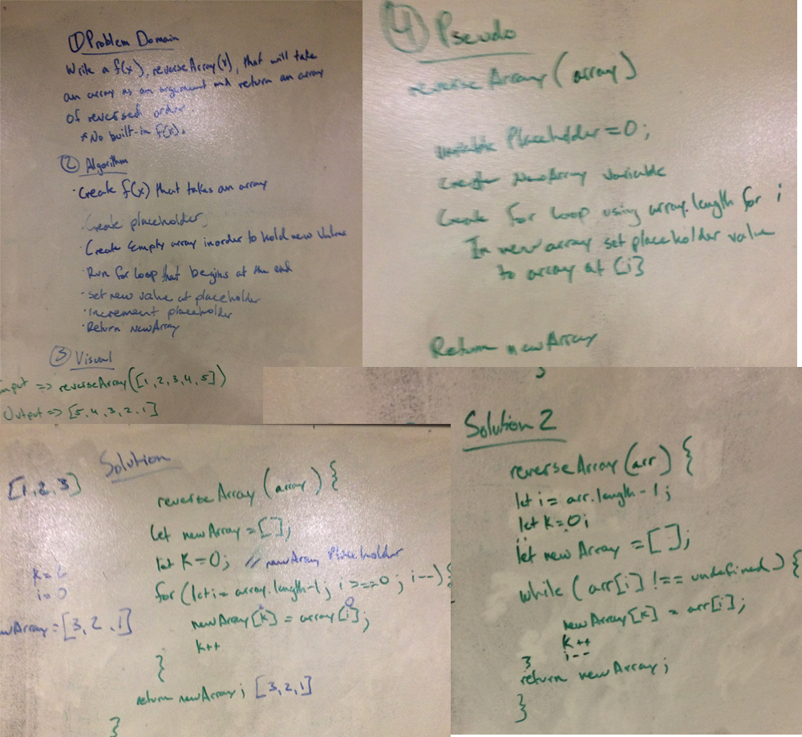
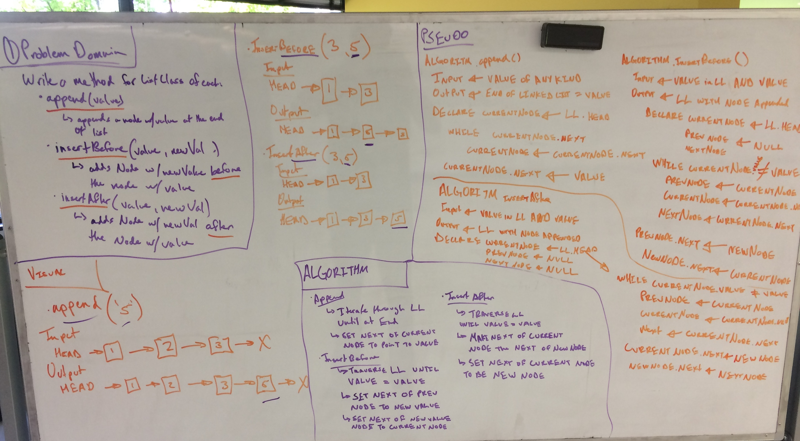
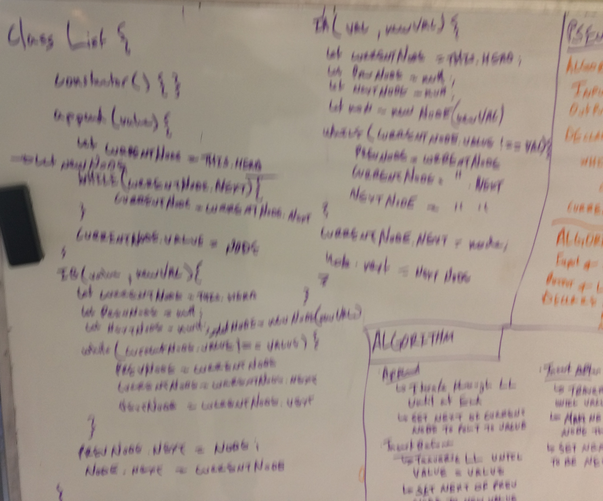
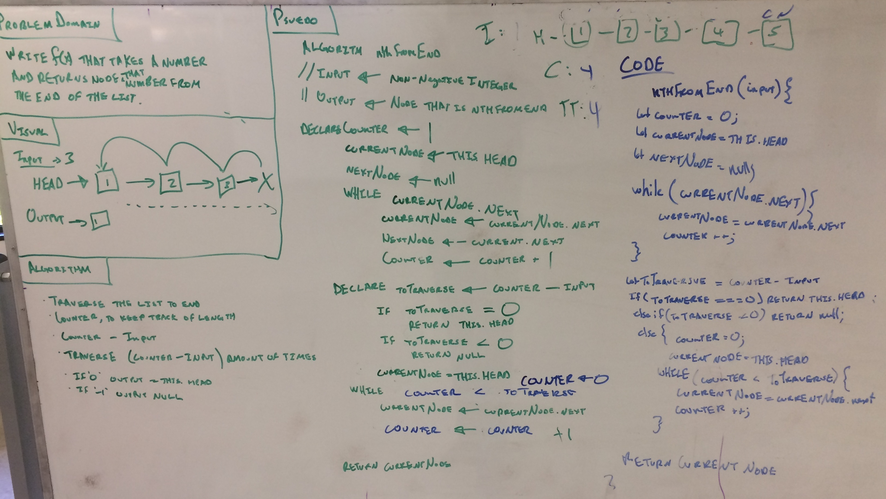

# Data Structures and Algorithms 

[](https://travis-ci.com/justeban/data-structures-and-algorithms)

*Whiteboard Challenges for Code Fellows seattle401d24*

### Table of contents

  * [Array Data Structure Modules](#array-data-structure-modules)
    * [Challenge 1 Reverse Array](#reverse-array)
    * [Challenge 2 - Insert and Shift Array](#insert-shift-array)
    * [Challenge 3 - Array Binary Search](#binary-search)
    * [Challenge 4 - Largest Adjacent Product](#adjacent-product)
  * [Linked List Data Structure Modules](#linked-list)
    * [Linked List Module Docs](#linked-list-help)
    * [Linked List Methods](#linked-list-methods)
      * [```append(value)```](#ll-append)
      * [```prepend(value)```](#ll-prepend)
      * [```reverse()```](#ll-reverse)
      * [```remove(offset)```](#ll-remove)
      * [```serialize()```](#ll-serialize)
      * [```deserialize(data)```](#ll-deserialize)
    * [Challenges](#ll-challenges)
      * [Linked List Insertions](#ll-challenge1)  
      * [Kth From End](#ll-challenge2)  
      * [Linked List Merge](#ll-challenge3)


## Array Data Structure Modules

<a id="reverse-array"></a>

### Challenege 1 - Reverse Array 


#### Challenge
Write a function called reverseArray which takes an array as an argument. Without utilizing any of the built-in methods available to your language, return the provided array argument with elements in reversed order.

#### Solution
*[Solution 1](https://github.com/justeban/data-structures-and-algorithms/blob/array_reverse/array_reverse.js/#L3)* - *[Solution 2](https://github.com/justeban/data-structures-and-algorithms/blob/array_reverse/array_reverse.js/#L16)*


<a id="insert-shift-array"></a>

### Challenege 2 - Insert and Shift Array

#### Challenge
Write a function called ```insertShiftArray``` which takes in an array and the value to be added. Without utilizing any of the built-in methods available to your language, return an array with the new value added at the middle index.

#### Solution
*[Solution](https://github.com/justeban/data-structures-and-algorithms/blob/array_shift/array_shift.js/#L1)*


<a id="binary-search"></a>

### Challenge 3 - Array Binary Search 

#### Challenge 

Write a function called ```BinarySearch``` which takes in 2 parameters: a sorted array and the search key. Without utilizing any of the built-in methods available to your language, return the index of the array’s element that is equal to the search key, or -1 if the element does not exist.

#### Solution


<a id="adjacent-product"></a>

### Challenge 4 - Largest Adjacent Product

#### Challenge 

Write a function called ```largestProduct``` which takes in a 2D array. Without utilizing any of the built-in methods available to your language, return the largest product of 2 adjacent values within the 2D array.

#### Solution

[Link to Code](https://github.com/justeban/data-structures-and-algorithms/blob/master/lib/array-data-structures/array_adjacent_product.js)


<a id="linked-list"></a>

## Linked List

<a id="linked-list-help"></a>

### Documentation

This ```Linked List ``` module is contained in the ```./lib/linked-lists/``` directory. This module makes use of, and requires two files - ```linked_list.js``` and ```node.js```.

```node.js``` contains a Node constructor and ```linked_list.js``` contains the linked list constructor and the methods available to the linked list. 

In order to use you'll need to require in only ```linked_list.js```.

```
const LL = require('./lib/linked_list.js');
```
We can then use the module. In order to create a new linked list: 

```let list = new  LL()```

This creates a linked list with a head value of ```null```.

<a id="linked-list-methods"></a>
We can now use the methods made available: 

* [```append(value)```](#ll-append)
* [```prepend(value)```](#ll-prepend)
* [```reverse()```](#ll-reverse)
* [```remove(offset)```](#ll-remove)
* [```serialize()```](#ll-serialize)
* ```deserialize(data)```

<a id="ll-append"></a>
```append(value)```
=============

```append(value)``` will take any value, create a Node, and attach the Node to the end of your list. If it is the first item, it will become the head of your list and ```list.head.value``` will equal whatever value you place as the parameter.

```
let list = new LL();

list.append('First Thing');

list.append('Second Thing');
```
The append works by creating a node with two properties: ```value``` and ```next```. ```value``` becomes whatever value you place in the parameter and ```next``` equals ```null```.

Our list now looks like this: 
```
LinkedList {
  head:
   Node {
     value: 'First Thing',
     next: Node { value: 'Second Thing', next: null } } }
```
If ```append()``` is given no value as a parameter an error will be thrown. 

<a id="ll-prepend"></a>
```prepend(value)```
===================

The ```prepend(value)``` method works similar to ```append()``` method except that it places the new Node at the beginning of your list replacing the ```head``` with whatever value you assign. 

```
let thirdValue = 'Third Thing';

list.prepend(thirdValue);
```
Results to: 
```
LinkedList {
  head:
   Node {
     value: 'Third Thing',
     next: Node { value: 'First One', next: [Node] } } }
```
```prepend()``` can be given any value be left empty an error will be thrown.

<a id="ll-reverse"></a>
```reverse()```
===================

```reverse``` will reverse the order of the link list you create. 

``` 
let list = new LL();

list.append('First Thing');

list.append('Second Thing');

list.reverse();
```
```list``` now equals: 
```
LinkedList {
  head:
   Node {
     value: 'Second Thing',
     next: Node { value: 'First Thing', next: null } } }
```
<a id="ll-remove"></a>
```remove(offset)```
===================

```remove(offset)``` works by taking in an ```offset```, which is a number, and removes the item at that place in the list. The ```offset``` is zero-based much like an array index.

For example, ```remove(0)``` will remove the first item, ```remove(1)``` will remove the second and so on.

Let's see it: 

```
let list = new LL();

list.append('First Thing');

list.append('Second Thing');

```

```list.remove(0)``` will remove ```'First Thing'``` from the list and make ```'Second Thing'``` the head. 

```
list.remove(0)

// LinkedList { head: Node { value: 'Second Thing', next: null } }

```
If we have a list with multiple nodes, ```remove(offset)``` will remove the item at that offset.

```
let list = new LL();

list.append('First Thing');

list.append('Second Thing');

list.append('Third Thing');

list.remove(1);
```
Our list will now look like: 
```
LinkedList {
  head:
   Node {
     value: 'First Thing',
     next: Node { value: 'Third Thing', next: null } } }
```
If ```remove(offset)``` is given an offset value that is not a number, a number less than 0 or a number that is greater than the length of the list, an error will be thrown.

<a id="ll-serialize"></a>
```serialize()```
===================

The ```serialize()``` method creates a JSON-valid Object that only holds the values of each node in an array. 

If we have a list:
```
let list = new LL();

list.append('First Thing');
list.append('Second Thing');
list.append('Third Thing');

let JSONdata = list.serialize();
```
```JSONdata``` looks like: 
```
["First Thing","Second Thing","Third Thing"]
```
<a id="ll-deserialize"></a>
```deserialize(data)```
===================

The ```deserialize(data)``` method will take any JSON-valid data and input that data into your linked list. 

It is a method so you must create a new instance of the list module and pass into the parameter your serialized data. 
```
let list = new LL();

let data = "[\"First Thing\", \"Second Thing\", \"Third Thing\", \"Fourth Thing\", \"Fifth Thing\"]";

list.deserialize(data)
```
Our list now looks like this: 
```
LinkedList {
  head:
   Node {
     value: 'First Thing',
     next: Node { value: 'Second Thing', next: [Node] } } }
     
  ```
<a id="ll-challenges"></a>

Challenges
=========

<a id="ll-challenge1"></a>

### Challenge 1 - Linked List Insertions

#### Challenge

Write the following methods for the Linked List class:

* ```.append(value)``` which adds a new node with the given value to the end of the list
* ```.insertBefore(value, newVal)``` which add a new node with the given newValue immediately before the first value node
* ```.insertAfter(value, newVal)``` which add a new node with the given newValue immediately after the first value node

#### Solution

[*Coded Solution*](./lib/linked-lists/challenge_01/ll.js) 




<a id="ll-challenge2"></a>
======

### Challenge 2 - Kth From End Method

#### Challenge

Write a method for the Linked List class which takes a number, k, as a parameter. Return the node that is k from the end of the linked list. You have access to the Node class and all the properties on the Linked List class as well as the methods created in previous challenges.

#### Solution

[*Coded Solution*](./lib/linked-lists/challenge_02/ll_kth_from_end.js) 



<a id="ll-challenge3"></a>
======

### Challenge 3 - Merge Two Linked Lists

*File located at ```'./lib/linked-lists/challenge_03/ll_merge.js'```*

*Requires methods from ```'./lib/linked-lists/linked_list.js'```

#### Challenge

Write a function called mergeLists which takes two linked lists as arguments. Zip the two linked lists together into one so that the nodes alternate between the two lists and return a reference to the head of the single list. Try and keep additional space down to O(1). You have access to the Node class and all the properties on the Linked List class as well as the methods created in previous challenges.

#### Solution

[*Coded Solution*](./lib/linked-lists/challenge_03/ll_merge.js) 


<a id="ll-challenge4"></a>
======

### Challenge 4 - Detect Loop

*File located at ```'./lib/linked-lists/challenge_04/ll_detect_loop.js'```*

*Requires methods from ```'./lib/linked-lists/linked_list.js'```

#### Challenge

Write a method called hasLoop that returns a boolean and determines whether or not a linked list has a loop or not. Will return true if linked list does have a loop and false if it doesn't. One of the goals was to not use any extra memory as we create this mehtod. 

#### Solution

[*Coded Solution*](./lib/linked-lists/challenge_04/ll_detect_loop.js) 

<!--  -->